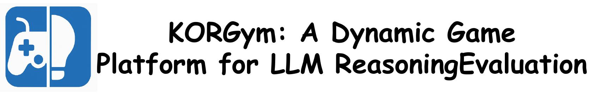
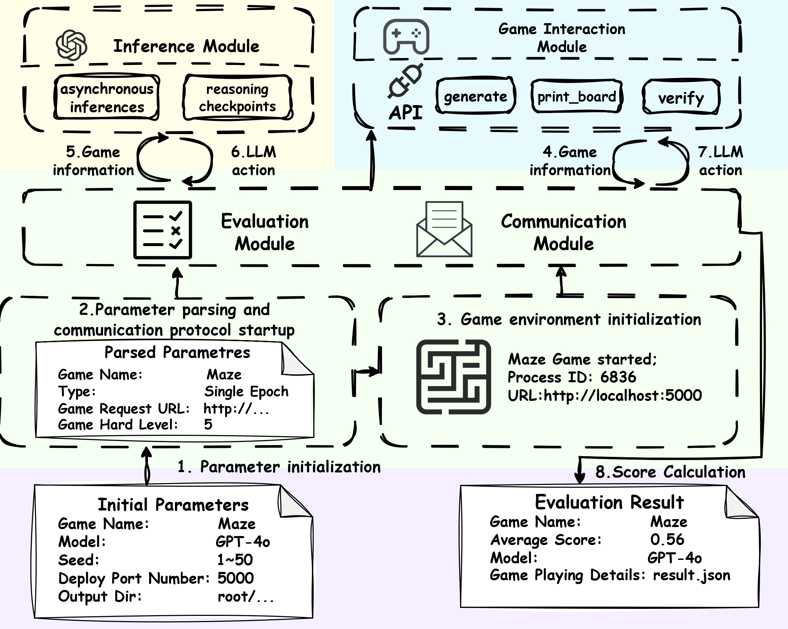

<div align="center">
<p align="center" width="100%">

</p>

<p align="center">
  <a href="https://github.com/multimodal-art-projection/KORGym/stargazers">
    </a>
  <a href="https://razor233.github.io/KORGYM_HomePage/">
    </a>
  <a href="https://razor233.github.io/KORGYM_HomePage/#leaderboard">
    </a>
  <br>
  <a href="https://razor233.github.io/KORGYM_HomePage/#Game Library">
    </a>
    <a href="https://huggingface.co/multimodal-art-projection/KORGym">
    </a>
  <a href="https://arxiv.org/abs/2505.14552">
    </a>
  <a href="LICENSE">
    </a>
</p>


</div>

## 🔔 Introduction

<p align="center">
   
</p>

**KORGym** is a dynamic game-based evaluation platform for large language models (LLMs), comprising over **50+ games across six reasoning dimensions**: mathematical and logical reasoning, control interaction reasoning, puzzle reasoning, spatial and geometric reasoning, strategic reasoning, and multimodal reasoning. The platform is organized into four modular components—the Inference Module, the Game Interaction Module, the Evaluation Module, and the Communication Module—that collectively support **multi-round evaluations, configurable difficulty levels, and robust reinforcement-learning integration**.

---

## ⚙️ Installation 

To install the required packages, run:

```bash
git clone https://github.com/RAZOR233/KOEGYM-SEED.git
cd ./KORGym
pip install -r requirements.txt
```

## 🚀 Quick Start
You can quick start like this:
1. Enter the scripts folder:
```bash
cd eval_lib/scripts
```
2. For closed-source models, please step to 3. For open-source models, you need to deploy them locally using vLLM, like this.
```bash
CUDA_VISIBLE_DEVICES=0,1,2,3,4,5,6,7 python -m vllm.entrypoints.openai.api_server --model model_path --served-model-name model_name --max_model_len=30000 --port=9003 --pipeline_parallel_size=2 --tensor_parallel_size=4 --gpu_memory_utilization=0.95 --enable-reasoning --reasoning-parser deepseek_r1
```

3. Configure the `run.sh`, the fields that need to be filled in include:
- `game_name`: Name of the game; simply copy the folder name from `game_lib`.
- `game_host`: URL of the game environment server; default is `0.0.0.0`.
- `game_port`: Port number where the game environment server is deployed.
- `model_name`: Name of the model to be evaluated.
- `api_key`: API key for accessing the model; use `None` for locally deployed open-source models.
- `base_url`: URL address used to send inference requests to the model.
- `output_dir`: Path for storing model response information and score statistics; default is `results`.

4. Conduct evaluation
```bash
bash run.sh
```


## 🛠️ Project Structure


### eval_lib
- `eval.py`:This file primarily handles the overall evaluation process, including argument parsing, protocol setup, game environment initialization, and LLM-environment interaction.

- `eval_lib.py`:This file primarily handles the overall evaluation process, including argument parsing, protocol setup, game environment initialization, and LLM-environment interaction.
- `utils.py`:This file provides utility functions for argument parsing, format validation, and other helper tasks.

### Results
This folder contains all of KORGym’s model inference results, prompts, experimental test data, and intermediate game state data.

### game_lib
This folder contains all the game files used in KORGym.


